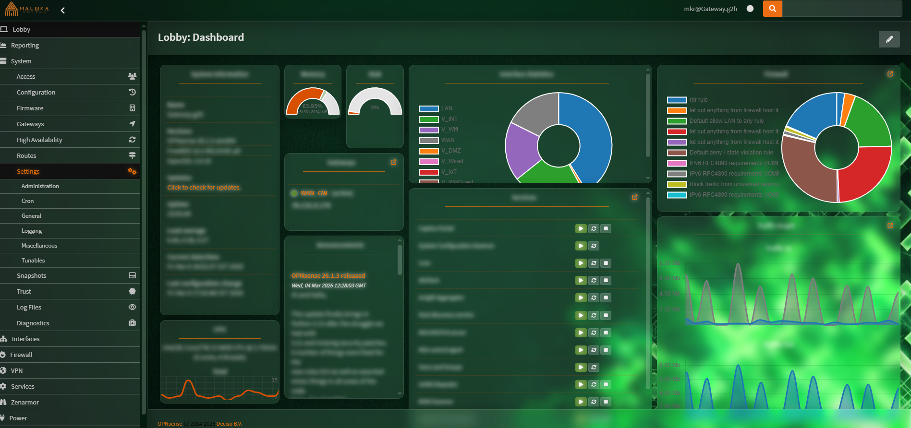
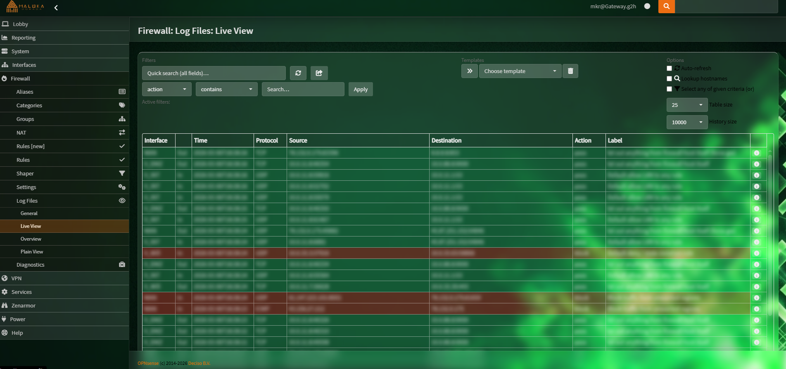
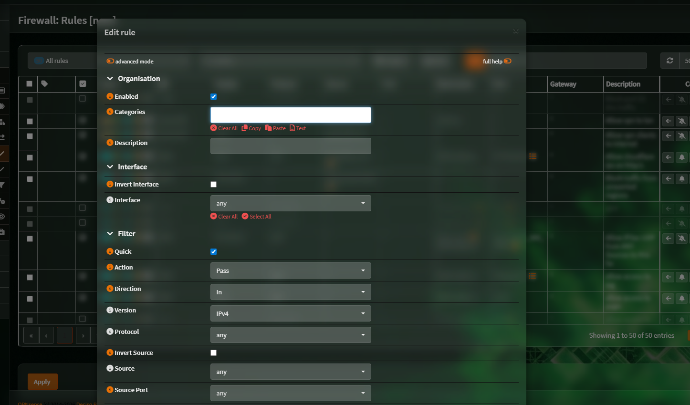
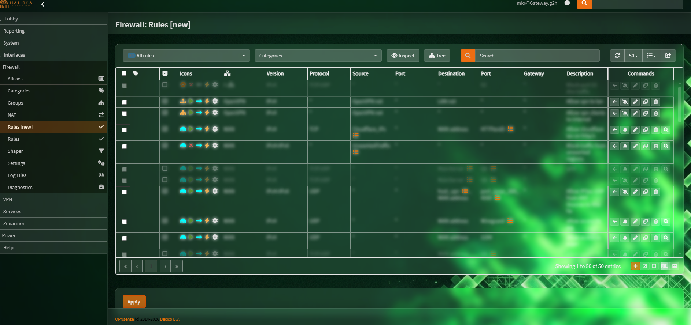
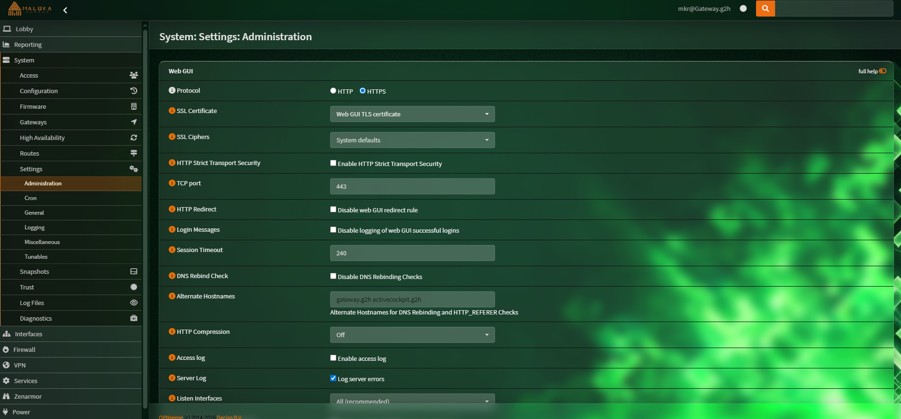
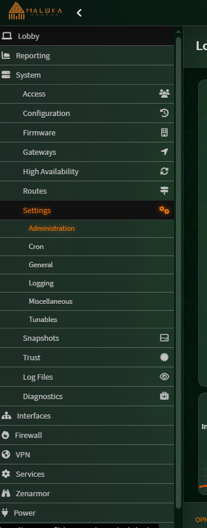

# Maloka Theme for OPNSense

A modern glass-morphism theme for OPNsense with customizable wallpaper support. Based on the Rebellion theme with enhanced visual effects.

## Features

- **Glass Effect Panels** - Frosted glass aesthetic on all UI panels
- **Customizable Wallpaper** - Easy background personalization
- **Rebellion Foundation** - Built on the proven Rebellion theme. I modified the rebellion theme

## Images







## Installation

1. Download the theme archive from the releases and unpack
2. Transfer via SFTP to `/usr/local/opnsense/www/themes/`
3. Select the theme from OPNsense settings

```bash
# Example SFTP command
sftp user@your-opnsense-ip
put theme-archive.tar.gz /usr/local/opnsense/www/themes/
```

## Customization

Modify the wallpaper by replacing the background image in the theme/build/images directory.
